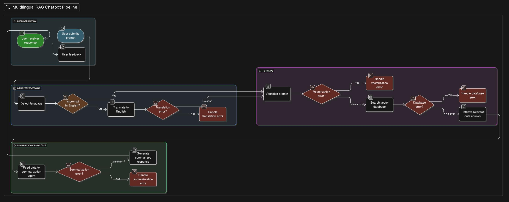

# RAG (Retrieval-Augmented Generation) with LangChain and OpenAI


## Setup and Installation

Follow these steps to get the application running on your local machine.

### 1. Prerequisites

-   Python 3.9+
-   Docker and Docker Compose (for running Qdrant)
-   A Google AI Studio API Key

### 2. Set up the Environment

Create and activate a Python virtual environment:

```bash
# For macOS/Linux
python3 -m venv venv
source venv/bin/activate

# For Windows
python -m venv venv
.\\venv\\Scripts\\activate
```

### 3. Install Dependencies

Install all the required Python packages from your terminal:

```bash
pip install "fastapi[all]" langchain-community pypdf langchain-text-splitters langchain-google-genai langchain-qdrant qdrant-client python-dotenv openai
```

### 4. Create `docker-compose.yml` file

In your project's root directory, create a file named `docker-compose.yml` and paste the following content into it. This will be used to run the Qdrant vector database.

```yaml
version: '3'
services:
  qdrant:
    image: qdrant/qdrant:latest
    ports:
      - "6333:6333"
      - "6334:6334"
    volumes:
      - ./qdrant_storage:/qdrant/storage
```

### 5. Start the Qdrant Vector Database

In your terminal, run the following command to start the Qdrant database using Docker:

```bash
docker-compose up -d
```
This will start a Qdrant instance and make it available at `http://localhost:6333`.

### 6. Create `.env` file for Environment Variables

In the same directory, create a file named `.env` and add your Google API key. This keeps your secret key out of the code.

```
GOOGLE_API_KEY="YOUR_GOOGLE_API_KEY_HERE"
OPENAI_API_KEY="YOUR_GOOGLE_API_KEY_HERE"
```